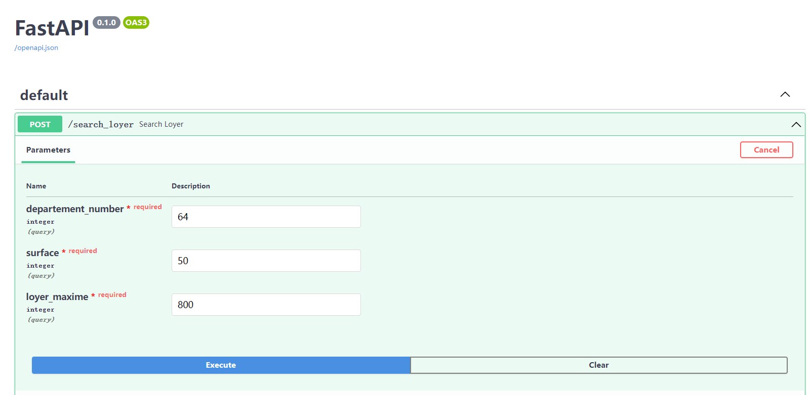
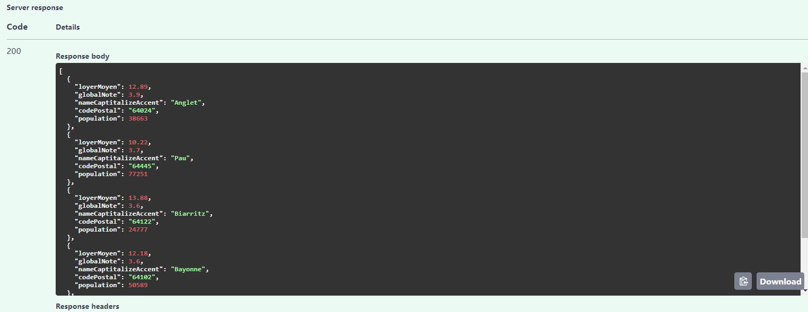

# About this Project


Using Fast Api to generate a simple POST request , 3 parameters to enter:
  - number of departement in France
  - surface maximum wanted 
  - rent maximum you want to pay

It will return a list of cities that meet the search criteria

External sources used in this project :
  - Note for each city:  https://www.bien-dans-ma-ville.fr/     
  - Average rental prices in 2018 in France：https://www.data.gouv.fr/fr/datasets/carte-des-loyers-indicateurs-de-loyers-dannonce-par-commune-en-2018/
  - Official api data source： https://api.gouv.fr/documentation/api-geo

## Run locally

Assuming you are under environment `Python 3.10`, under the root folder , run the following command to start project:

```python

pip install -r requirements.txt # Install necessary packages
python main.py
```

After server started, you can open this url [http://127.0.0.1:8080/docs](http://127.0.0.1:8080/docs)  




## Run with Docker
### Pull from dockerhub

`https://hub.docker.com/repository/docker/yaozeliang/axione`

```
docker run -d --name <your container name> -p 80:80 axione`

```

## Project overview

- Server
  - `API design` : Fastapi  
  - `API Interface` : Swagger UI (already intergrated in fastapi)

- Folder
  - `utils` : custom functions
  - `base` : class Ville and necessay crawler function (In real life, we should use MultiThreading for I/0 bound issue to improve performance)
  - `base`: save logs, for this demo, I just collect some important logs

- Other
  - `source_yaml`: config file for API endpoint
  - `main.py`: entrance of the project and api design
